# PULSE Framework – Controlled AI-Assisted Development

[](https://opensource.org/licenses/MIT)
[](packages/pulse-cli)
[](packages/pulse-mcp)
[](https://manuel-fuss.de/pulse)

**PULSE** is a complete toolkit for controlled AI-assisted software development: methodology, CLI commands, MCP server for Cursor IDE, automatic safeguards, and loop detection.

```bash
# Quick Start
npm install && npm run build
npm link -w packages/pulse-cli -w packages/pulse-mcp

cd your-project
pulse init --mcp    # Initialize with Cursor integration
```

> **Target Audience:** Senior Developers and Tech Leads who want structured, safe AI-assisted development.

---

## ⚡ Before vs After

<p align="center">
  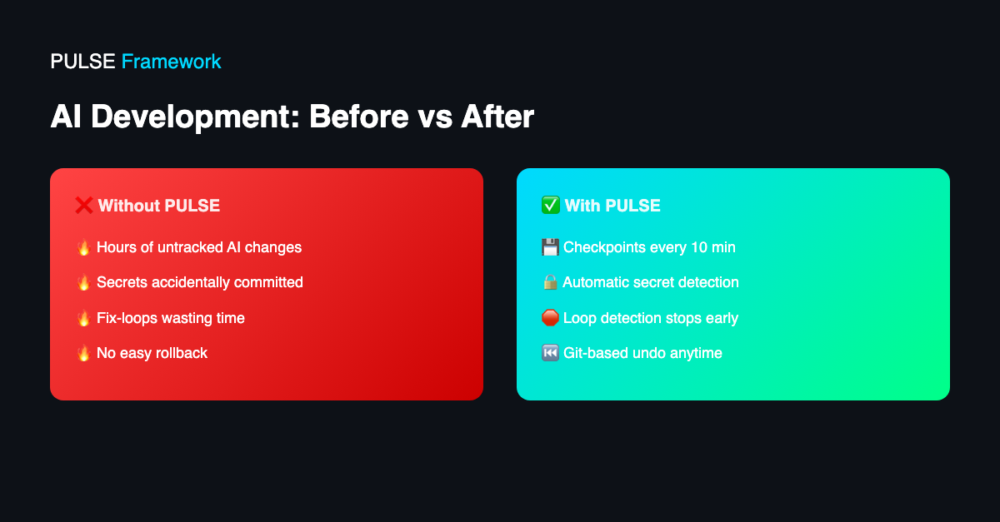
</p>

---

## 🔄 The Workflow

<p align="center">
  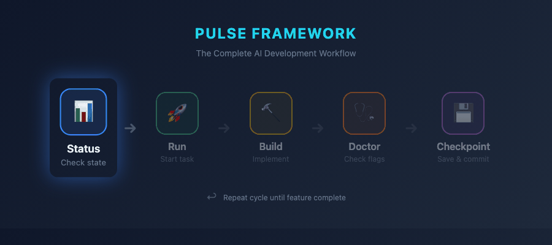
</p>

**Status** → **Run** → **Build** → **Doctor** → **Checkpoint** → *repeat*

---

## 🛡️ The 5 Safeguards

<p align="center">
  
</p>

---

## 🎬 Extension Features

### ⏱️ Always-On Status Bar Timer

<p align="center">
  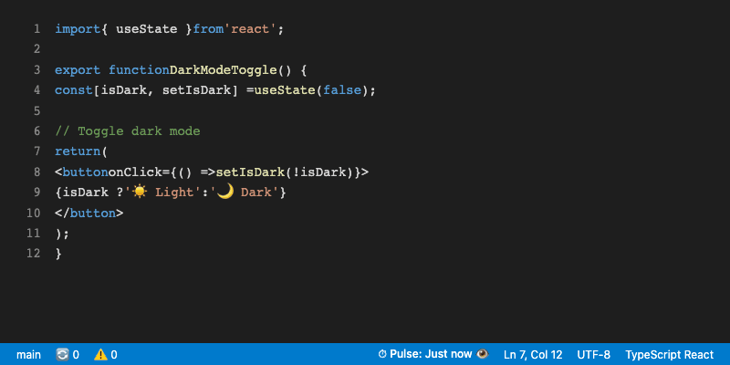
</p>

- **Visual checkpoint reminder** – See exactly how long since your last commit
- **Color-coded warnings** – Green → Yellow → Red as time passes
- **One-click access** – Click to open checkpoint menu instantly

---

### 🚀 One-Click Project Setup

<p align="center">
  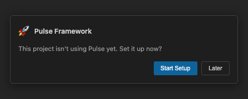
</p>

- **Auto-detection** – Pulse recognizes uninitialized projects automatically
- **Fullstack preset** – Sensible defaults for most projects
- **Zero config** – MCP server, Git hooks, and Cursor rules installed in one click

---

### 💾 Smart Checkpoint (AI-Generated Commits)

<p align="center">
  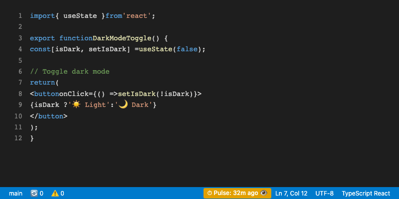
</p>

- **Context-aware** – The AI generates commit messages from your chat history
- **No copy-paste** – Zero friction between coding and committing
- **Git best practices** – Meaningful, structured commit messages every time

---

### ⏸️ Snooze & Stop Watcher

<p align="center">
  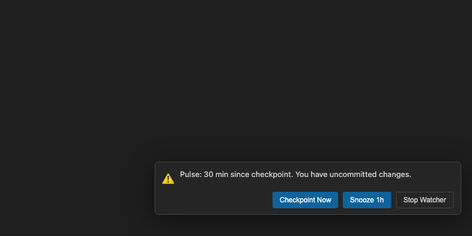
</p>

- **Non-intrusive reminders** – Only notifies when you have uncommitted changes
- **Snooze 1 hour** – Take a break without spam
- **Stop Watcher** – Disable completely when you need deep focus

---

**If Pulse helps your workflow, please ⭐ Star the Repository.**

---

## 💻 CLI Commands

### `pulse status` – Check Project State

<p align="center">
  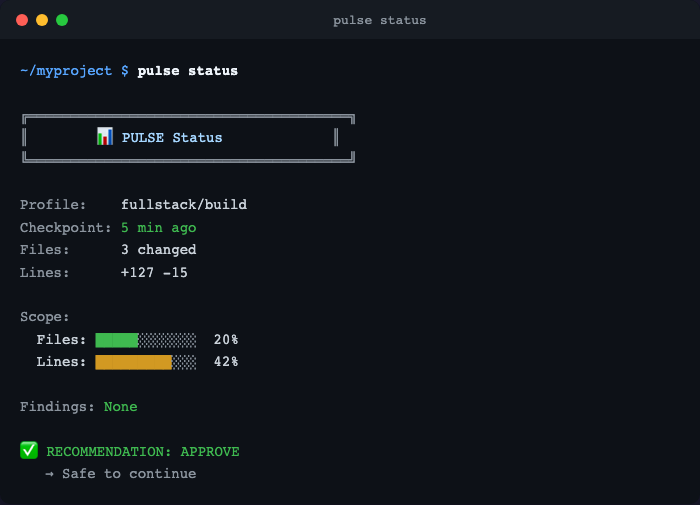
</p>

---

### `pulse doctor` – Scan for Red Flags

<p align="center">
  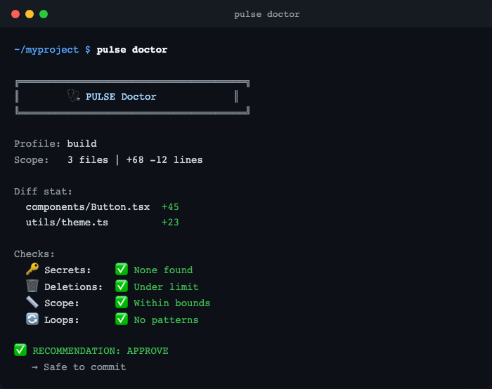
</p>

---

### `pulse doctor` – Warning Example (Secrets + Mass Delete)

<p align="center">
  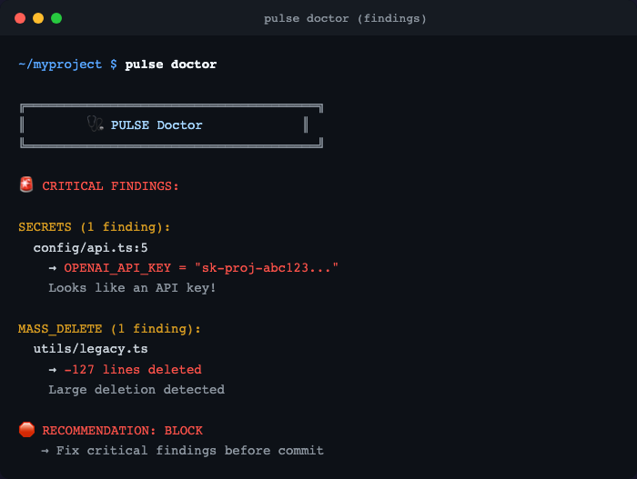
</p>

---

### `pulse run` – Start New Feature

<p align="center">
  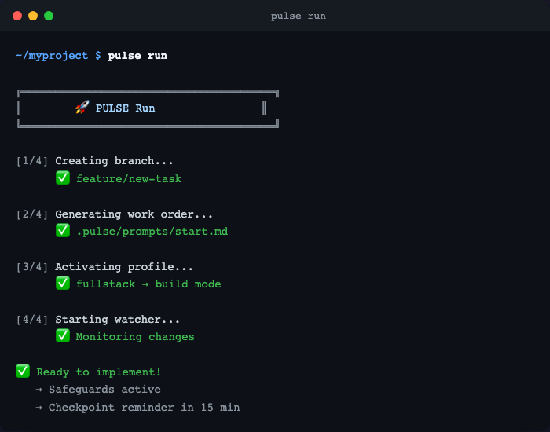
</p>

---

### `pulse checkpoint` – Save Progress

<p align="center">
  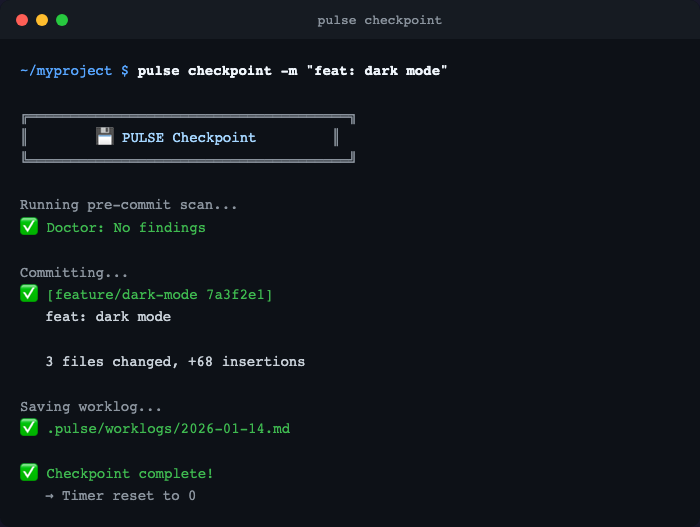
</p>

---

### `pulse doctor --loop` – Detect Fix-Loops

<p align="center">
  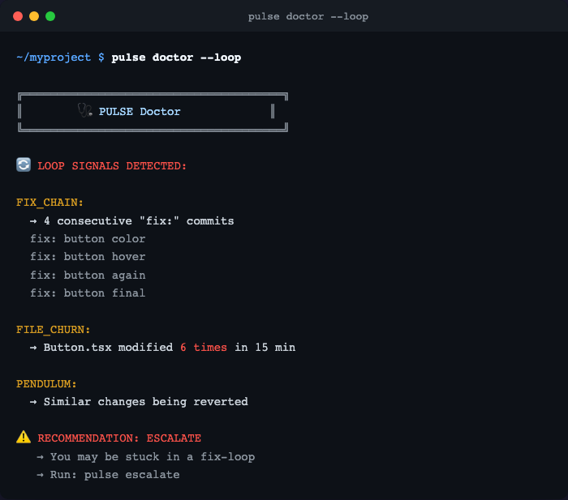
</p>

---

## 🤖 Agent Mode (MCP Tools)

The AI agent automatically calls PULSE tools during your conversation. Here's what it looks like:

### 📊 Status Check (Before Every Response)

<p align="center">
  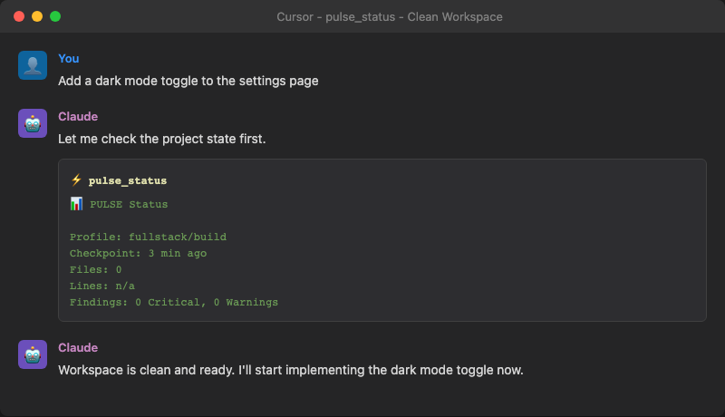
</p>

- **Automatic** – Agent calls `pulse_status` before every response
- **Checkpoint tracking** – Shows time since last commit
- **Scope awareness** – Tracks files and lines changed

---

### ⚠️ Checkpoint Overdue Warning

<p align="center">
  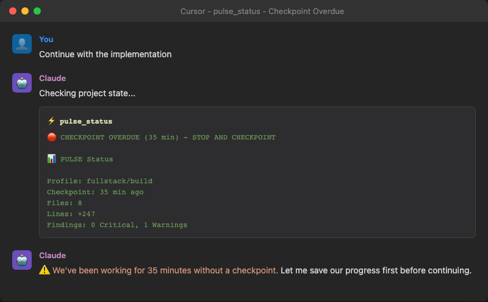
</p>

- **30-minute rule** – Stops the agent when checkpoint is overdue
- **Protects your work** – Forces a save before continuing
- **Clear action** – Agent creates checkpoint automatically

---

### 🔑 Secret Detection

<p align="center">
  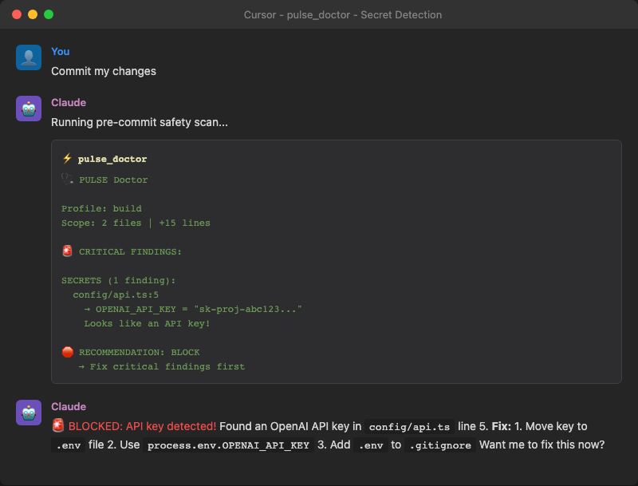
</p>

- **Pre-commit scan** – Catches API keys before they leak
- **Blocks commit** – Won't let you push secrets
- **Shows solution** – Tells you exactly how to fix it

---

### 🔄 Loop Detection

<p align="center">
  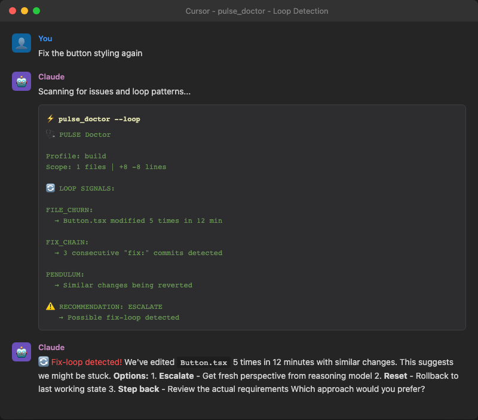
</p>

- **Fix-chain detection** – Catches when you're stuck
- **File churn tracking** – Same file edited 5+ times
- **Suggests escalation** – Get fresh perspective

---

### 🆘 Escalation (When Stuck)

<p align="center">
  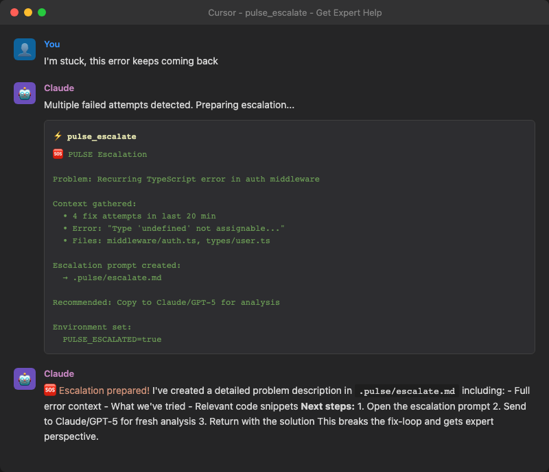
</p>

- **Automatic trigger** – After 2-3 failed fix attempts
- **Context export** – Full problem description for GPT-5/Claude
- **Breaks the loop** – Get expert help, not more guessing

---

### 📚 Learn (Capture Knowledge)

<p align="center">
  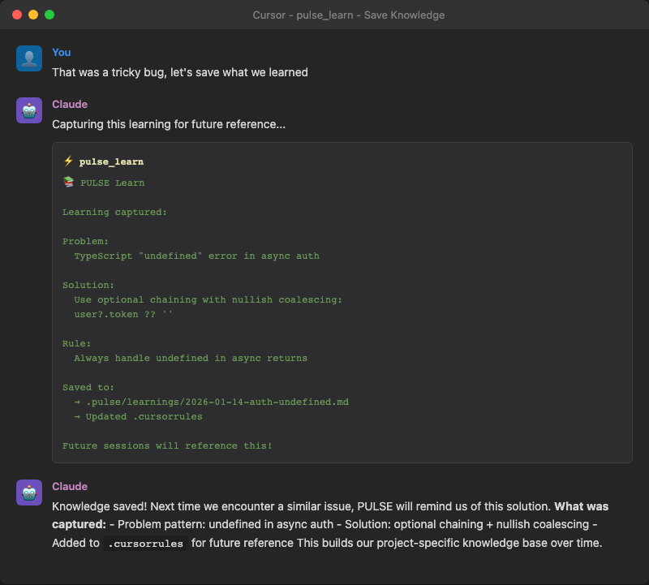
</p>

- **Save solutions** – After fixing tricky bugs
- **Auto-updates rules** – Future sessions remember
- **Project knowledge base** – Gets smarter over time

---

### 🚀 Run (Start New Feature)

<p align="center">
  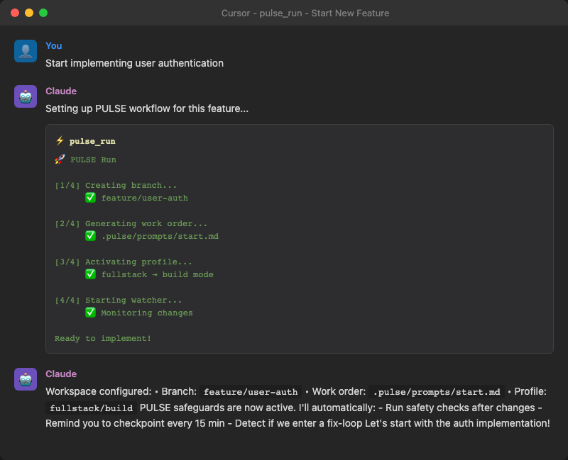
</p>

- **Branch creation** – Auto-creates feature branch
- **Work order** – Generates structured prompt
- **Profile activation** – Applies right safeguards

---

### ✅ Review (Pre-Merge Check)

<p align="center">
  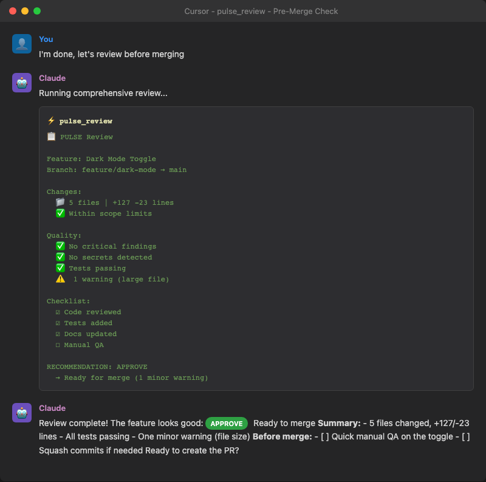
</p>

- **Quality checklist** – Automated pre-merge review
- **Scope validation** – Files, lines, tests
- **Clear recommendation** – Approve / Review / Block

---

### 🔄 Correct (Course Correction)

<p align="center">
  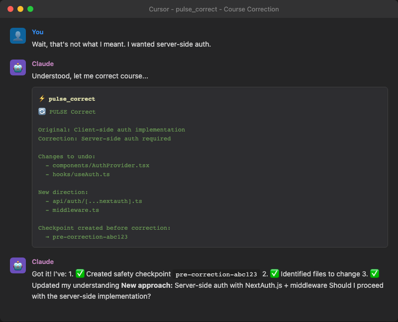
</p>

- **Direction change** – When requirements shift
- **Safety checkpoint** – Saves before correction
- **Clear path forward** – New implementation plan

---

## 🚀 Proven at Scale: 14B+ Tokens

PULSE isn't theory. It's the distilled experience of **14.22 Billion Tokens** and **21.9K Agentic Sessions** in 2025.


- **Top 3% Globally** in AI-assisted development velocity
- Tested across complex refactors, greenfield builds, and escalation loops
- Built from real production experience with Claude, GPT-4, and Cursor

---

## What's in the Box

| Component | Description |
|-----------|-------------|
| **CLI** (`pulse`) | 13 commands for prompts, checkpoints, safeguards, escalation |
| **MCP Server** (`pulse_*`) | 10 tools for automatic Cursor IDE integration |
| **Cursor Rules** | Auto-injected safeguards for every AI conversation |
| **AGENTS.md** | Universal rules for Windsurf, Copilot, Cline, etc. |
| **Loop Detection** | 5 patterns to catch fix-chains, reverts, file-churn |
| **Git Hooks** | Pre-commit and pre-push safeguards |

---

## Installation

### Quick Start (Recommended)

```bash
# 1. Clone and build
git clone https://github.com/manuelfussTC/PulseFramework.git
cd PulseFramework
npm install && npm run build
npm link -w packages/pulse-cli -w packages/pulse-mcp

# 2. Initialize in your project
cd /path/to/your/project
pulse init --mcp

# 3. Restart Cursor - Done!
```

### What `pulse init --mcp` does automatically

| Step | What happens |
|------|--------------|
| 1 | Checks if `pulse-mcp` is installed, installs if needed |
| 2 | Creates `.pulse/` directory with config |
| 3 | Creates `.cursor/mcp.json` with **absolute paths** (no PATH issues) |
| 4 | Creates `.cursor/rules/pulse.mdc` (auto-safeguards) |
| 5 | Detects workspace mismatch and fixes it |
| 6 | Validates everything works |

### Installation Options

| Command | What it does | When to use |
|---------|--------------|-------------|
| `pulse init` | Basic setup without MCP | Manual workflow |
| `pulse init --mcp` | Local MCP config | **Recommended for Cursor** |
| `pulse init --mcp --global` | Global MCP in `~/.cursor` | One-time setup for all projects |
| `pulse init --agents` | Creates `AGENTS.md` | Windsurf, Copilot, Cline |

### After Installation

1. **Restart Cursor** (Cmd+Shift+P → "Developer: Reload Window")
2. Check MCP status: **Settings → Features → MCP** → `pulse` should be green
3. Test: Ask Cursor something - it will automatically call `pulse_status`

### Requirements

- **Git repository**: Pulse requires your project to be a Git repo
- **One repo per workspace**: Open the specific project folder containing `.git`, not a parent folder with multiple repos

### Troubleshooting

| Problem | Solution |
|---------|----------|
| "MCP Server not found" | Restart Cursor |
| "pulse-mcp: command not found" | `npm link -w packages/pulse-mcp` |
| Rules not loading | Check if `.cursor/rules/pulse.mdc` exists |
| Wrong working directory | Use `--global` flag or check workspace setup |
| "Not in a git repository" | Open the folder containing `.git`, not a parent |

### Structure after Init

```
your-project/
├── .pulse/
│   ├── state.json
│   └── templates/roles/
├── .cursor/
│   ├── mcp.json          # MCP server config (absolute paths)
│   └── rules/pulse.mdc   # Auto-safeguards (alwaysApply: true)
├── .cursorrules          # Fallback rules
└── pulse.config.json     # Project config
```

---

## Usage

### CLI Commands (Human)

```bash
pulse status              # Quick project overview
pulse run                 # Start workflow (creates branch + prompt)
pulse checkpoint -m "msg" # Git commit with safeguard check
pulse doctor --loop       # Check for problems + loop detection
pulse escalate -C         # Create escalation for external AI
pulse review              # Decision briefing before merge
pulse learn               # Save knowledge from solved problems
pulse reset               # Safe git reset for loop recovery
```

### MCP Tools (Agent)

When using Cursor with `--mcp`, the agent automatically calls:

| Tool | When |
|------|------|
| `pulse_status` | Before every response |
| `pulse_doctor` | After code changes |
| `pulse_checkpoint` | Every 5-10 minutes |
| `pulse_escalate` | After 2-3 failed attempts |

---

## Core Concepts

### The 3-Layer Architecture

| Layer | Purpose | Tool |
|-------|---------|------|
| **1: Concept** | Planning, architecture | ChatGPT, Claude |
| **2: Build** | Implementation | Cursor Agent Mode |
| **3: Escalation** | Complex problems | GPT-5, Opus |

### The 5 Safeguards (Non-Negotiable)

1. ⏱️ **30-Minute Rule** – Stop and checkpoint after 30 min autonomous
2. 🗑️ **Delete Guard** – No file deletion without confirmation
3. 📤 **Push Guard** – No git push without confirmation
4. 🔐 **Secrets Guard** – No API keys, passwords in code
5. 📋 **Checkpoint** – Git commit every 5-10 minutes

### Loop Detection (5 Patterns)

| Pattern | Signal |
|---------|--------|
| Fix-Chain | 3+ "fix" commits in a row |
| Revert | A↔B toggling detected |
| File-Churn | Same file changed 5+ times |
| Pendulum | Similar commit messages repeating |
| Fix-No-Test | Fix commits without test changes |

### Red Flags Overview

<p align="center">
  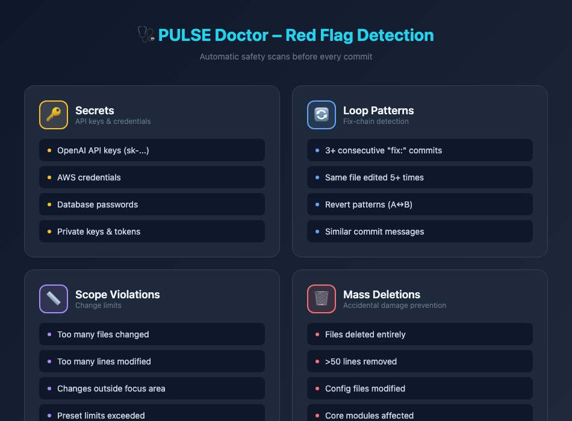
</p>

---

## 📋 Quick Reference

| Format | Link |
|--------|------|
| 📄 Cheatsheet (Markdown) | [PULSE-Cheatsheet.md](docs/cheatsheet/PULSE-Cheatsheet.md) |
| 🖼️ Cheatsheet (Visual) | [PULSE-Cheatsheet.png](docs/cheatsheet/PULSE-Cheatsheet.png) |
| 📖 CLI Reference | [pulse-cli.md](docs/tooling/pulse-cli.md) |
| 📖 MCP Reference | [pulse-mcp.md](docs/tooling/pulse-mcp.md) |
| 📖 Technical Reference | [Technical Reference](docs/PULSE-Technical-Reference-2026-01-06.md) |
| 📖 Workflow Guide | [workflow.md](docs/workflow.md) |
| 🗒️ Changelog | [CHANGELOG.md](CHANGELOG.md) |

---

## Repository Structure

```
PulseFramework/
├── packages/
│   ├── pulse-cli/          # CLI toolkit (13 commands)
│   │   ├── src/commands/   # init, status, run, checkpoint, doctor, ...
│   │   ├── src/lib/        # prompts, scanner, briefing, ...
│   │   └── templates/      # .cursorrules, pulse.mdc, AGENTS.md
│   ├── pulse-mcp/          # MCP server (10 tools)
│   │   └── src/tools/      # status, run, checkpoint, doctor, ...
│   └── pulse-vscode/       # VS Code extension (basic)
├── docs/
│   ├── tooling/            # CLI + MCP reference docs
│   ├── cheatsheet/         # Quick reference
│   ├── deep-dive/          # Advanced guides
│   └── workflow.md         # How to use PULSE
├── spec/                   # Framework specification
├── templates/              # Standalone templates (for manual use)
└── examples/               # Example implementations
```

---

## Presets

When running `pulse init`, choose a preset that matches your project:

| Preset | Max Files | Max Lines | Checkpoint |
|--------|-----------|-----------|------------|
| `frontend` | 10 | 250 | 15 min |
| `backend` | 15 | 400 | 20 min |
| `fullstack` | 15 | 300 | 15 min |
| `monorepo` | 25 | 600 | 25 min |

---

## Workflow Example

```bash
# 1. Start a new feature
pulse run
# → Creates branch, generates prompt, starts watcher

# 2. Work with Cursor (agent calls MCP tools automatically)
# → pulse_status before each response
# → pulse_doctor after code changes
# → pulse_checkpoint reminders

# 3. When stuck
pulse escalate -C
# → Copy prompt to ChatGPT/Claude for external analysis

# 4. Before merge
pulse review
# → Decision briefing: Approve / Reject / Escalate

# 5. Save learnings
pulse learn
# → Capture problem → solution → rule for future
```

---

## Support & Community

If PULSE helps your workflow, please **⭐ Star the Repository**.

**Author:** Manuel Fuß  
**Website:** [manuel-fuss.de/pulse](https://manuel-fuss.de/pulse)  
**Email:** [kontakt@manuel-fuss.de](mailto:kontakt@manuel-fuss.de)

---

## License

MIT License – See [LICENSE](LICENSE) for details.

Contributions welcome! Issues, PRs, and feedback appreciated.
