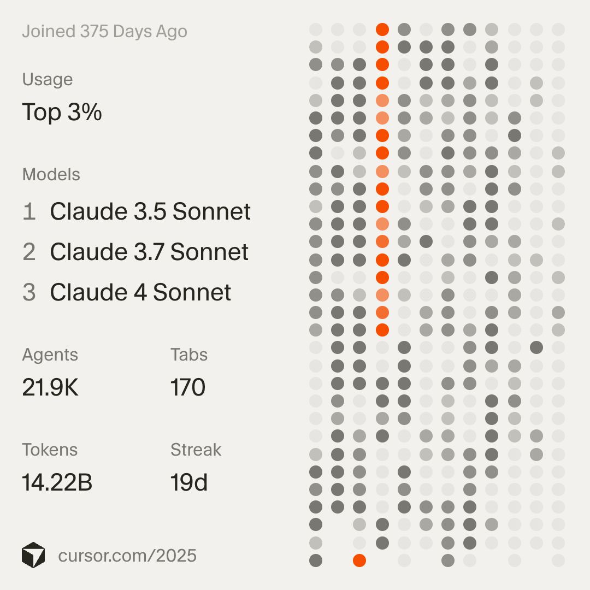

# Pulse Framework – Controlled Agentic Development with LLMs

Pulse is a methodology for building software with LLM agents under strict human control – with explicit loops, guardrails, and debug workflows.

> **Target Audience:** This framework is for **Senior Developers** and **Tech Leads**. It is not a beginner's guide. It requires discipline and a willingness to question established workflows.
> **Distinction:** This is not a "Prompt Engineering Guide". It is a **Working Methodology** for high-velocity, safe agentic development.

## 🚀 Proven at Scale: 14B+ Tokens in 2025
Pulse isn't theory. It is the distilled experience of **14.22 Billion Tokens** and **21.9K Agentic Sessions** in a single year (2025). 

- **Top 3% Globally** in AI-assisted development velocity.
- Built on the transition from Sonnet 3.5 to Claude 4 and GPT-5.1.
- Tested across complex refactors, greenfield builds, and deep-reasoning escalation loops.

## Problem Statement
In real-world AI-assisted development, teams face critical failure modes when adopting agentic workflows:
- **Uncontrolled Loops:** Agents cycling through changes without convergence.
- **Hidden Failure Modes:** Subtle logic bugs introduced during mass refactoring.
- **Wasted Cycles:** Time lost supervising agents on trivial tasks without strategic oversight.
- **Unsafe Changes:** Direct commits or deletions without appropriate human verification steps.

Pulse addresses these by imposing a rigorous control layer over the interaction between human engineers and LLM agents.

## Core Ideas

### 1. The 3-Layer Architecture
- **Layer 1: Concept & Strategy (Concept LLM)**
  High-level architectural planning. Using reasoning models to define *what* needs to be built before coding starts.
- **Layer 2: Build & Implementation (Build LLM)**
  The execution layer (e.g., Cursor Agent Mode). Agents write code, but operate within strict boundaries defined by Layer 1.
- **Layer 3: Escalation & Problem Solving**
  A dedicated path for handling stuck agents or complex bugs, utilizing "second opinion" models or max-reasoning modes.

### 2. The Pulse Loops
Development moves in discrete cycles called "Pulses":
- **Start Pulse:** Defining the task context and constraints.
- **Correction Pulse:** Iterative adjustments when the agent deviates.
- **Review Pulse:** Human verification before committing changes.

### 3. Safeguards
- **30-Minute Rule:** If a task isn't solved in 30 minutes, escalate.
- **Git as Safety Net:** Commit frequency and branching strategies designed for rollback.
- **Strict Boundaries:** Rules against unverified deletion or push actions.

## Repository Structure

- `spec/`: The technical specification of the Pulse Framework (v1.0).
- `examples/`: Reference implementations of Pulse loops in TypeScript.
- `templates/`: Production-ready configuration files.
  - `.cursorrules`: Drop-in safety rules for Cursor Agent Mode.
- `docs/deep-dive/`: The Knowledge Base (Senior-Level Guides).
- `CHALLENGES.md`: Open questions and challenges for tool vendors (Cursor, OpenAI, etc.).
- `docs/`: Additional guides and workflow patterns.

## Getting Started

1.  **Read the Specification:** Start with `spec/pulse-spec-v1.md` to understand the methodology.
2.  **Master the Deep Dives:** Read `docs/deep-dive/model_strategy.md` and `docs/deep-dive/prompting_mastery.md`.
3.  **Install the Rules:** Copy `templates/.cursorrules` to your project root to enforce Pulse safeguards.
4.  **Explore the Examples:** Review `examples/` to see how these concepts map to actual development workflows.

## 🌟 Support & Community
If this framework helps you scale your agentic workflow, please **Star the Repository**. It helps us establish Pulse as an engineering standard.

## Contact & Professional Context
**Author:** Manuel Fuß  
**Website:** [manuel-fuss.de/pulse](https://manuel-fuss.de/pulse)  
**Email:** [kontakt@manuel-fuss.de](mailto:kontakt@manuel-fuss.de)

## Status & Versioning
**Current Status:** Early Public Spec – v1.0

Pulse has been tested in real-world engineering projects but is designed to evolve. It is currently a living standard under active refinement.

## License & Contributions
This project is licensed under the MIT License.
Feedback, issues, and pull requests are welcome. We specifically invite tooling vendors to engage with `CHALLENGES.md`.

